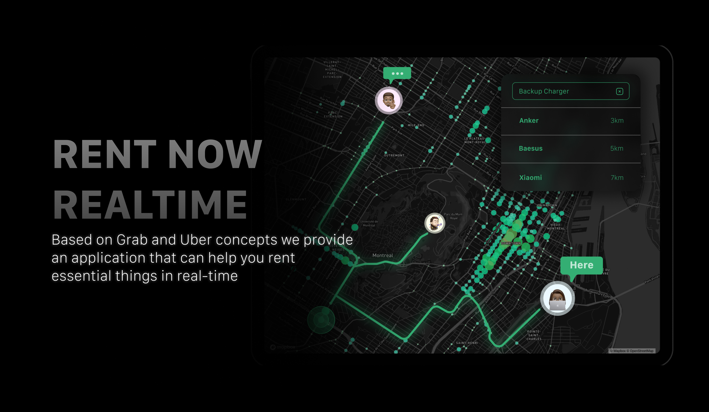

# Rent Everything



## The purpose of this project

> Help people to rent everything they need with real time data.

## Technologies

> What I am using in this fullstack template

- Client Side
  - [React](https://reactjs.org/)
  - [Next.js](https://nextjs.org/)
- Server Side
  - [Node.js](https://nodejs.org/)
  - [Express.js](https://expressjs.org/)
  - [PostgreSQL](https://www.postgresql.org/)
  - [Redis](https://redis.io/)
  - [GraphQL](https://graphql.org/)
  - [Apollo](https://www.apollographql.com/)

## Configuration

1. Configure the redis.conf file to use Redis as the cache store.
2. Configure the docker-compose file to set up password and user for each service.
3. Configure the .env file following .example.env in each service to set up the environment value.

## Installation

1. Run docker-compose to start the postgresql and redis containers

```bash
docker-compose up -d
```

2. [Start the API Service](./api_service/README.md)

3. [Start the Search Service](./search_service/README.md)

4. [Start the Chat Service](./chat_service/README.md)

5. [Start web app](./web_app/README.md)
